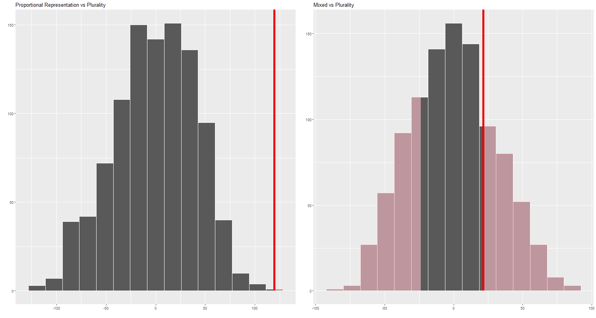

## Project description

Polarization is a central issue in contemporary political science, but its definition is tied to the bipartisan nature of the US party system. In this study, I aim to capture a broader phenomenon that affects multi-party political systems: partisan divide. While polarization in a two-party system assumes a dichotomic opposition of political stances, multi-partisan division allows for heterogenous inter-party accordance across different dimensions of political conflict. In other words, party A might agree with party B on a specific issue, but may strongly disagree with it on a different one. This allows for the existence of complex framing strategies that go beyond the left/right (liberal/conservative) dichotomy.
The main goal of this study is to determine whether some electoral systems are more likely to be associated with higher partisan divide.


## Data sources

For this project, I will be using the [Manifesto Project Dataset](https://manifesto-project.wzb.eu/) to quantify partisan heterogeneity. Data about electoral systems will be scraped from the Institute for Democracy and Electoral Assistance's (IDEA) [Electoral System Design Database](https://www.idea.int/data-tools/data/electoral-system-design)

The Manifesto Project provides data on ideological connotations of political manifestos through the following process: first, it breaks up each manifesto into independent semantic units. Secondly, it labels each unit based on its ideological content. For example, sentences emphasizing the need for tighter border patrol might fall under the label "negative views on immigration". The main dataset lists the relative frequency of each ideological category in a given political manifesto, expressed in percentage points.

## Analytical setup

My analysis focuses on 11 countries (Sweden, Norway, Denmark, Finland, Netherlands, France, Italy, Spain, Germany, United Kingdom, Ireland), covering elections from 1944 to 2021. The ultimate units of my analysis are parties in a given electoral cycle. I conceive each party as a point in an N-dimensional space, where N is the number of categories present in the Manifesto Project (MP) dataset. Party coordinates are determined by the relative frequency of the ideological categories, as specified above. I am interested in quantifying variability in ideological positioning within each electoral cycle and country (henceforth, Within Group Variability, WGV). To do so, I employ the following metric:

$$MSW_e = \frac{1}{P}\sum_{p = 0}^{P}\sum_{c = 0}^{C}(X_{pc} - \bar{X_c})^2$$
Where $MSW_e$ (Mean of Squares Within) is the within-group variability for election $e$, $P$ is the number of parties running in the election, and $C$ is the number of dimensions. 

## Exploratory analysis

As a preliminary analysis, I explore some of the features of the data.\

### The effect of the number of parties

There seems to be a positive correlation between the number of parties and the average distance between each party and the "partisan average". Each point represents an election cycle.

```{r layout="l-body-outset", echo = FALSE, message=FALSE, warning = FALSE}
library(tidyverse)
elections <- read_csv("data/elections_export.csv")
elections |> 
  ggplot(aes(x = parties, y = wgv)) + 
  geom_point() + geom_smooth(method = "lm", color = "indianred1") + 
  labs(x = "Number of parties",
       y = "Within-group variability",
       title = "Relationship between number of parties and variability among parties",
       subtitle = "226 elections in 11 countries") + theme_classic()
```


### The effect of electoral systems

Merging the "Manifesto" data with information about electoral systems by the Institute for Democracy and Electoral Assistance, I obtained a dataset comprising 89 unique election cycles, each linked to a specific electoral system. The three kinds of systems represented in the dataset are Proportional Representation, Plurality, and Mixed systems. "Mixed" includes systems that elect representatives through both a plurality and a PR channel, and "Plurality" includes two-round systems, regardless of the system used in the first round (there is no major difference between the two in terms of the metric of interest.)

Proportional Representation Systems are associated with higher average levels of partisan divide.

```{r echo = FALSE, message = FALSE, warning=FALSE}
elections_sys <- read_csv("data/elections_sys_export.csv")

elections_sys |> group_by(systfam) |> 
  summarize(mean_wgv = mean(wgv)) |> 
  knitr::kable(digits = 1, 
               col.names = c("System Family", "Average WGV"))
```

Are these differences statistically significant? To answer this question, I perform a simulation-based permutation test. While the difference in means between Plurality and Mixed systems is not statistically significant (p = .49), the one between Plurality and PR is (simulation-based p = 0)



## Interpretation and conclusion [DRAFT]

The main takeaways of the present analysis relate to the effect of the number of parties electoral system on partisan divide.
Proportional representation systems favor smaller parties by allowing minoritarian subjects to have a seat in Parliament. In contrast, plurality systems encourage parties to seek a relative (or absolute, in two-party systems) majority. Consistently with the Median Voter Theorem, the necessity to cater to a larger number of voters will result in parties gravitating towards the political center, therefore mechanically leading to smaller levels of partisan divide.